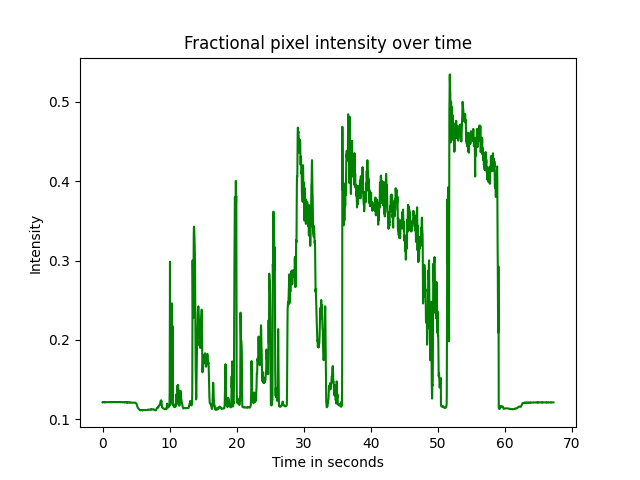

# pixelsum
Python scripts to read video files, calculate the sum or mean of the pixel values by frame, and plot results

## Installation

`sudo apt install python3 python3-pip ffmpeg`  
`pip install -r requirements.txt`

## Running

`./pixelsum.py filename.mp4`

Will output a plain text file with the calculated values, as well as a plot in PNG format

Sample plot:  

`./heatmap.py filename.mp4`

Will output an npy file with a 2D matrix containing the mean pixel values for each frame in the video, as well as a plot in PNG format

