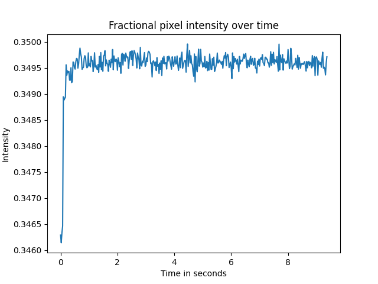

# pixelsum
Python script to read a video file, sum the pixel values by frame, and plot results

## Installation

`sudo apt install python3 python3-pip ffmpeg`  
`pip install -r requirements.txt`

## Running

`./pixelsum.py filename.mp4`

Will output a plain text file with the calculated values, as well as a plot in PNG format

Sample plot:  
